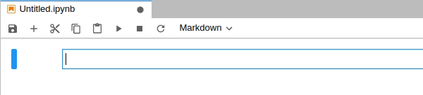

# jupyterlab_spellchecker

A JupyterLab extension highlighting misspelled words in markdown cells within notebooks and in the text files.



The JupyterLab extension is based on [the spellchecker Jupyter Notebook extension](https://github.com/ipython-contrib/jupyter_contrib_nbextensions/tree/master/src/jupyter_contrib_nbextensions/nbextensions/spellchecker) and relies on [Typo.js](https://github.com/cfinke/Typo.js) for the actual spell checking. Spellchecker suggestions are available from the context menu.

The extension provides (Hunspell) [SCOWL](http://wordlist.aspell.net/) dictionaries for American, British, Canadian, and Australian English.

## JupyterLab Version
The extension has been tested up to JupyterLab version 2.2.0.

## Installation

```bash
jupyter labextension install @ijmbarr/jupyterlab_spellchecker
```

## Development

For a development installation (requires npm version 4 or later), do the following in the repository directory:

```bash
npm install
npm run build
jupyter labextension link .
```

To rebuild the package and the JupyterLab app:

```bash
npm run build
jupyter lab build
```
